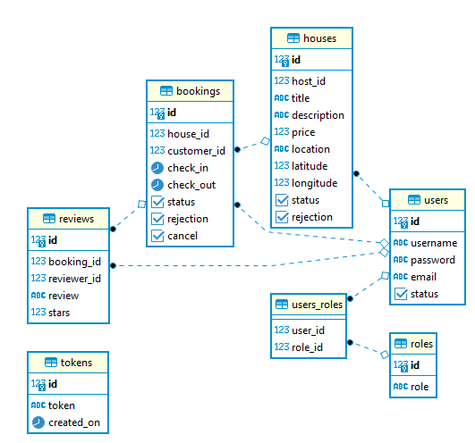

Background:

This application consists of five modules:

1) Authenticator service: For issuing JWT token and refresh it after timeout
2) Rental Processor: Required rental APIs
3) Rental Search: Required search APIs
4) Service Registry: For service discovery
5) API Gateway: For service path

The authenticator service generates a JWT token with refresh token and expiration time which is saved in database. 
Every other micro-service (rental processor/search) is secured and requires this JWT token to accept request. 

The Booking api calls rental processor from rental search and it is concurrency enabled. 
All api has been implemented as required.

Technology:

1) Spring Boot
2) Eureka Client/Server
3) PostgreSQL

Database Schema:

